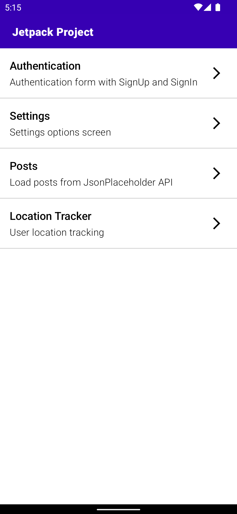
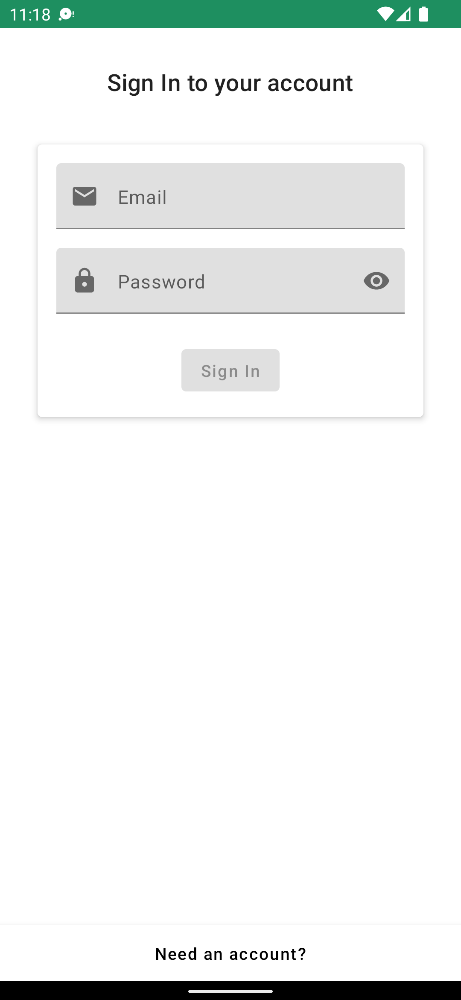
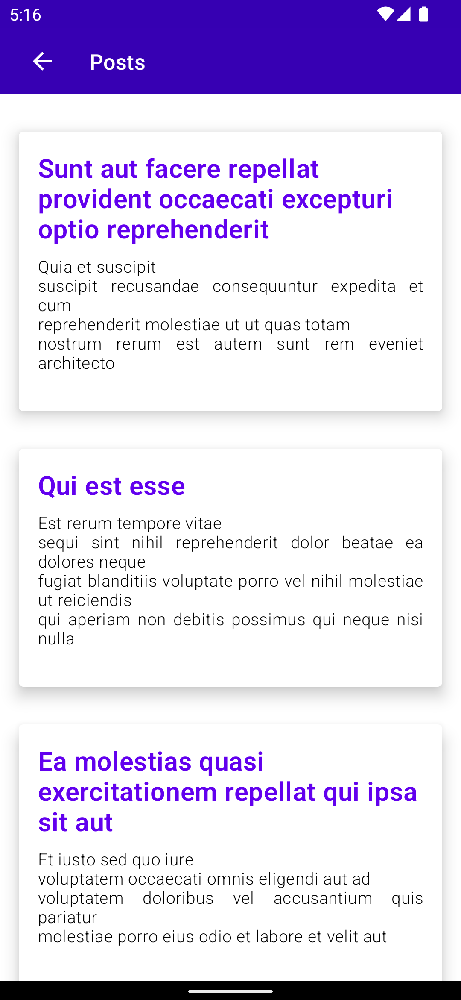
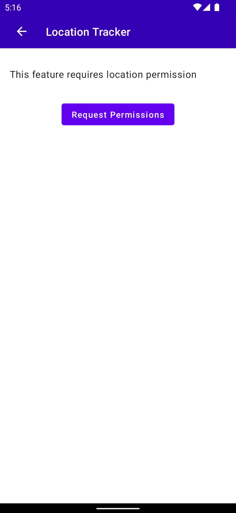
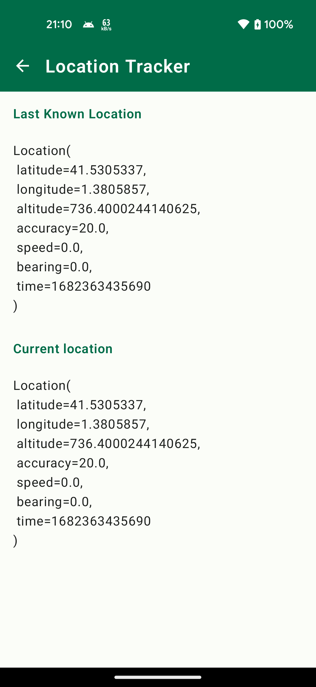
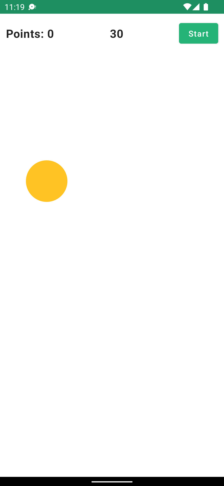

# Jetpack

It is a personal project to experiment with Android development.

## Home

It is the home screen where you can select some of experiments of this project.

ℹ️ Some experiments are not completed in terms of development, you can see on code maybe is missing testing or some data/domain layer.

## Authentication

Authentication form with SignUp and SignIn

## Settings

Settings options screen

## Posts

Load posts from JsonPlaceholder API

## Location tracker

User location tracking

 

## Ball clicker (Game)

Ball clicker game (custom view with compose)

