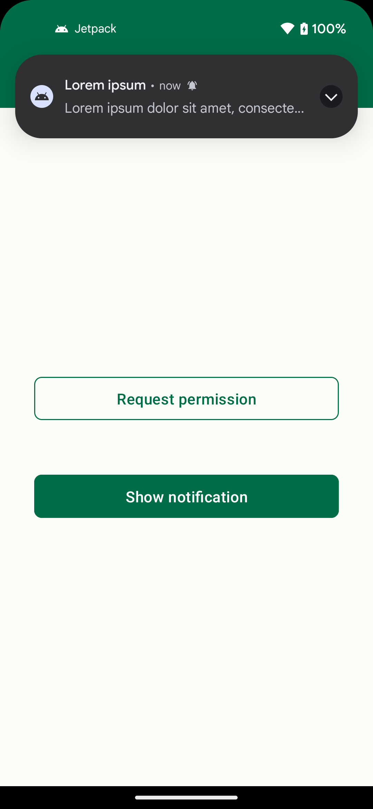
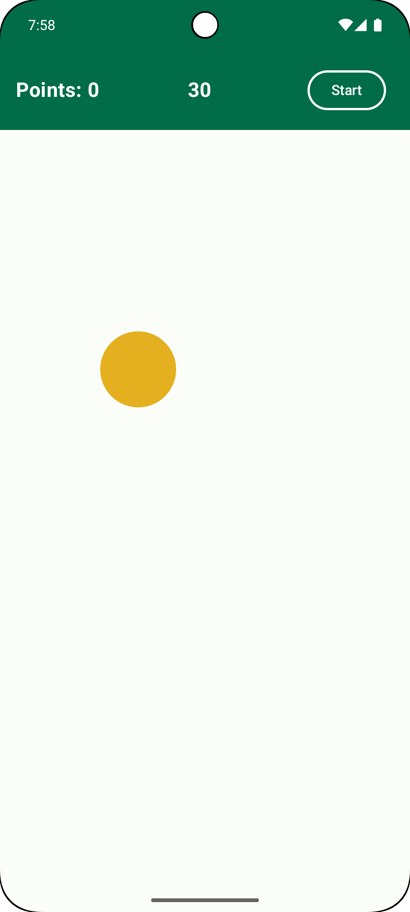
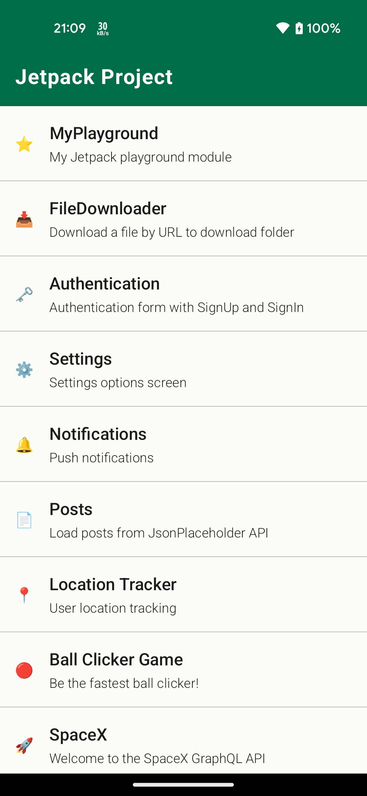

# Jetpack playgrounds

It is a personal project to experiment with Android development.

ℹ️ Some experiments are not completed in terms of development, you can see on code maybe is missing testing or some data/domain layer.

## Home

It is the home screen where you can select some of experiments of this project.

## Authentication

Authentication form with SignUp and SignIn

## Settings

Settings options screen

## Notifications

Push Notifications screen

## Posts

Load posts from JsonPlaceholder Rest API

## Location tracker

User location tracking

 

## Ball clicker (Game)

Ball clicker game (custom view with compose).

## SpaceX

This experiment shows past launches of SpaceX using SpaceX GraphQL API with expandable card detail.

# File downloader

Download files using a [DownloadManager](https://developer.android.com/reference/android/app/DownloadManager)

