# Jetpack playgrounds

It is a personal project to experiment with Android development.

ℹ️ Some experiments are not completed in terms of development, you can see on code maybe is missing testing or some data/domain layer.

## Home

It is the home screen where you can select some of experiments of this project.

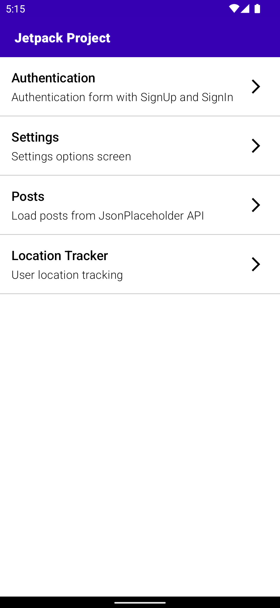

## Posts

Load posts from JsonPlaceholder Rest API. 
Uses adaptive layouts to support both phone and tablet form factors.  

This module is the most complete in the project and demonstrates modern Android architecture and robust testing practices: 

- **Architecture**: MVI (Model-View-Intent) pattern.
- **UI**: Built entirely with Jetpack Compose.
- **Data Layer**: Offline-first architecture with Room database persistence. Cache-first strategy with network fallback.
- **Background work**: Automatic background refresh every 24 hours.
- **Error Handling**: Functional error handling using Arrow `Either` and typed errors.
- **Testing**: Highly covered with JUnit 5 unit tests, Kotest `BehaviorSpec` BDD tests, and Compose snapshot testing using Roborazzi.

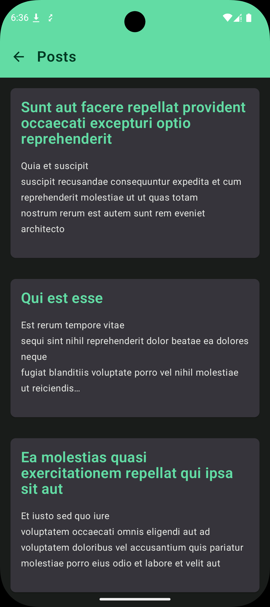
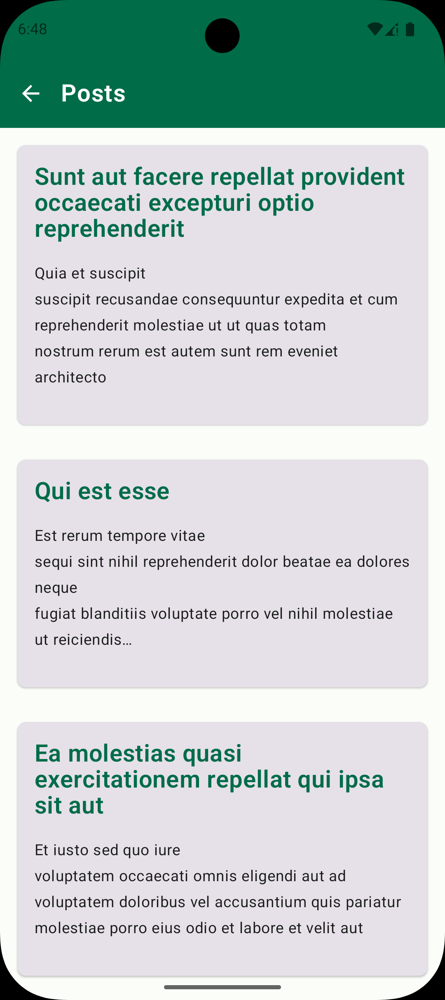
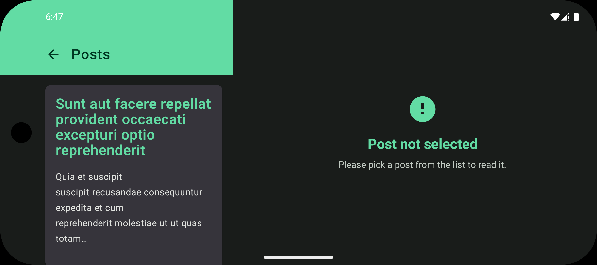
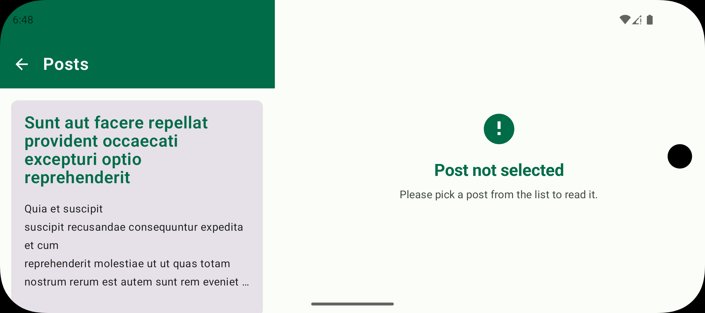
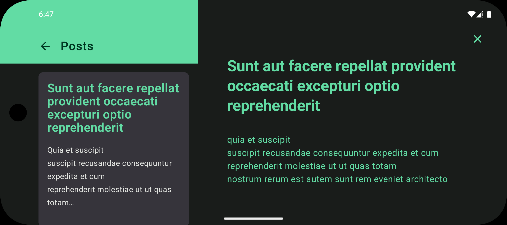
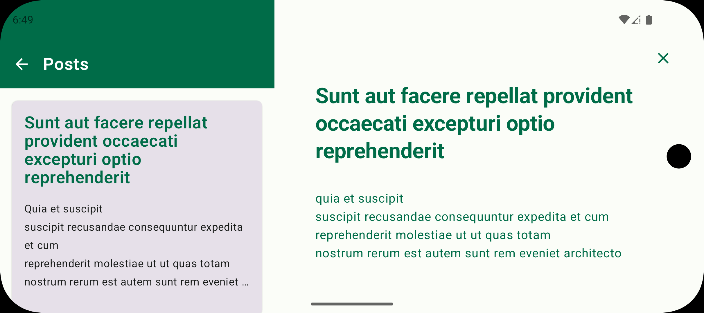
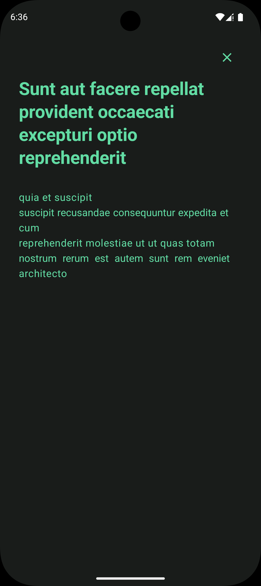
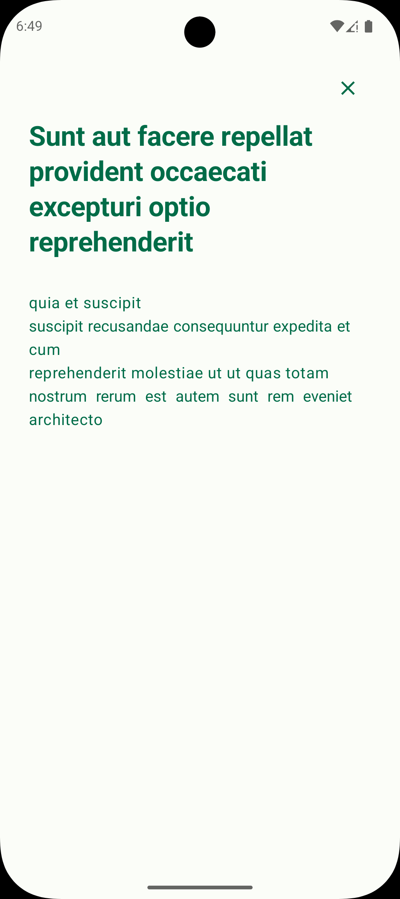

## Authentication

Authentication form with SignUp and SignIn.  
More experiment info: 

- Experiment with testing: unit test, snapshot tests and android tests

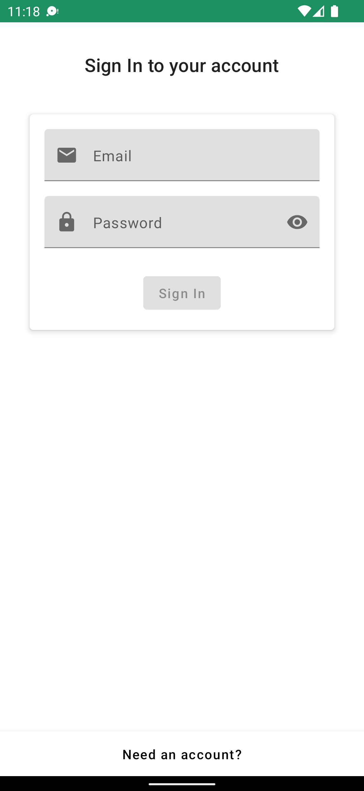

## Settings

Settings options screen.  
More experiment info: 

- Not persisted settings 
- Experiment with testing: unit test, snapshot tests and android tests

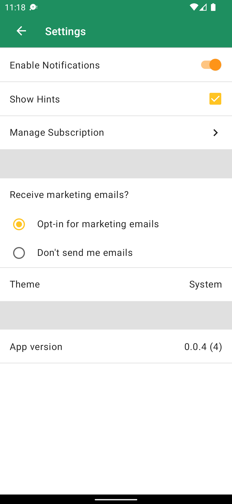

## Notifications

Push Notifications screen.  
More experiment info: 

- Experiment without testing.

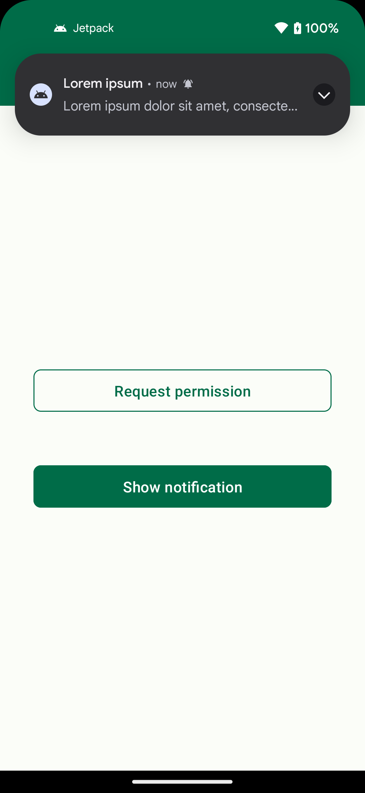

## Location tracker

User location tracking  
More experiment info: 

- Experiment without testing.

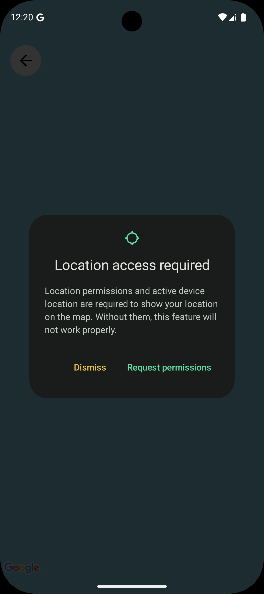 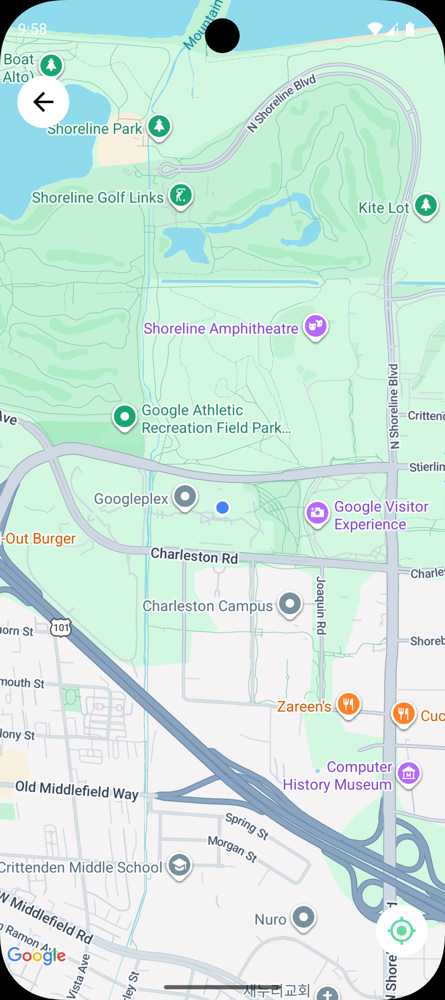

## Ball clicker (Game)

Ball clicker game (custom view with compose).  
More experiment info: 

- Experiment without testing.

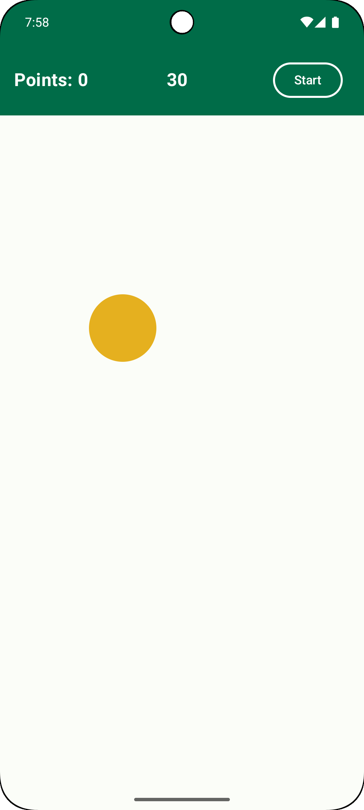

## File downloader

Download files using a [DownloadManager](https://developer.android.com/reference/android/app/DownloadManager)  
More experiment info: 

- Experiment without testing.

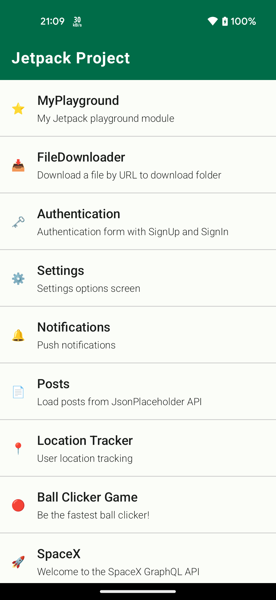
