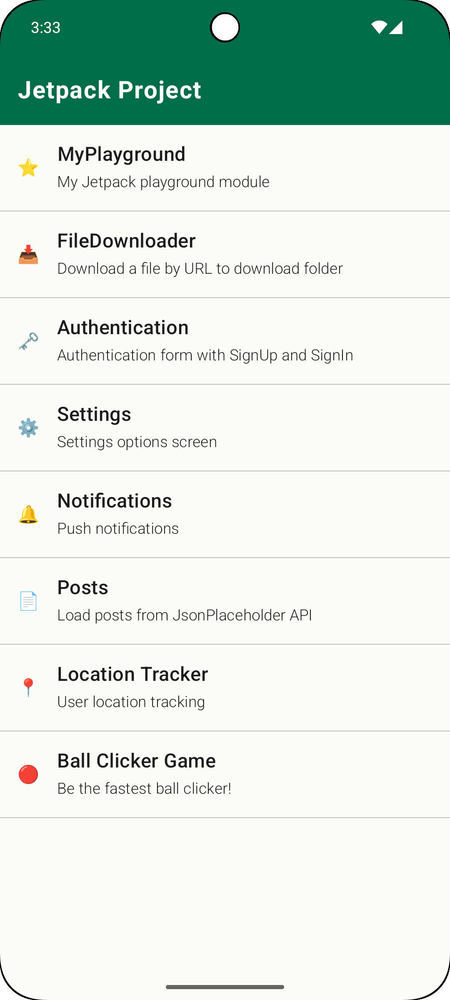
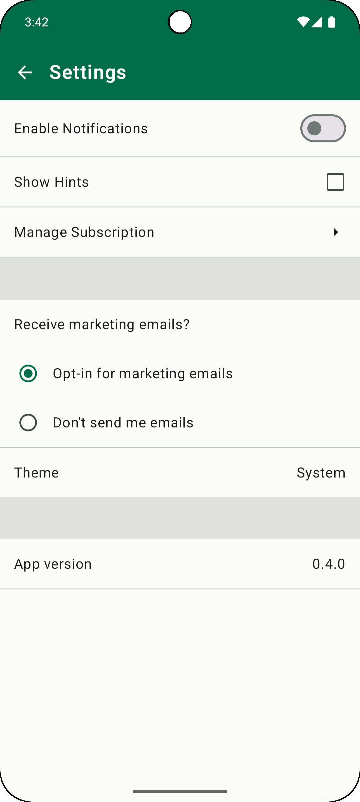
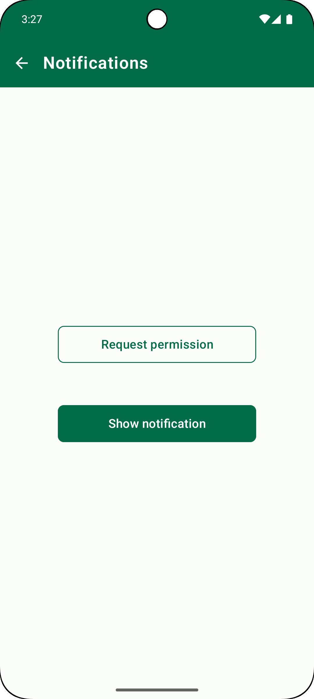
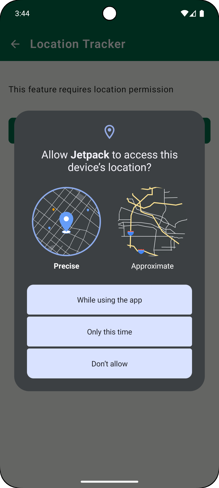
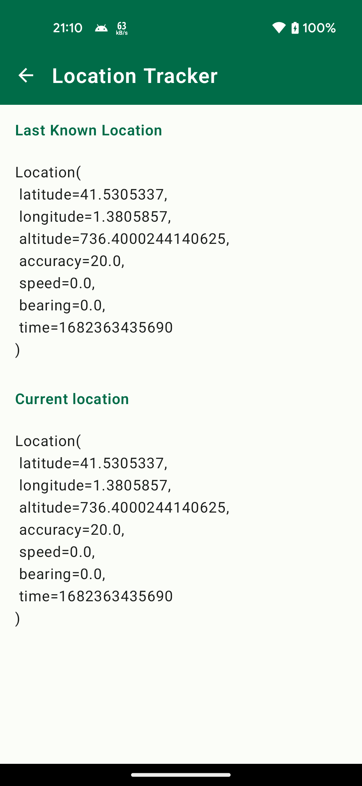
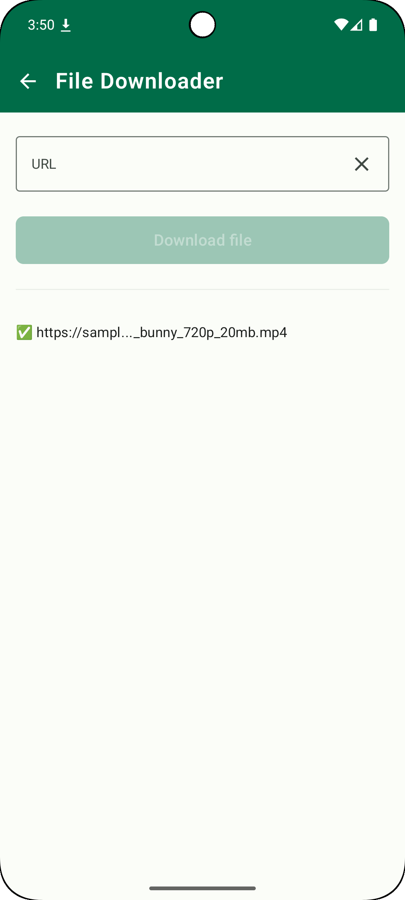

# Jetpack playgrounds

It is a personal project to experiment with Android development.

ℹ️ Some experiments are not completed in terms of development, you can see on code maybe is missing testing or some data/domain layer.

## Home

It is the home screen where you can select some of experiments of this project.

## Authentication

Authentication form with SignUp and SignIn.  
More experiment info: 
- Expriment with testing: unit test, snapshot tests and android tests

## Settings

Settings options screen.  
More experiment info: 
- Not persisted settings 
- Experiment with testing: unit test, snapshot tests and android tests

## Notifications

Push Notifications screen.  
More experiment info: 
- Experiment without testing.

## Posts

Load posts from JsonPlaceholder Rest API  
More experiment info: 
- Experiment with testing: unit test, snapshot tests.

## Location tracker

User location tracking  
More experiment info: 
- Experiment without testing.

 

## Ball clicker (Game)

Ball clicker game (custom view with compose).  
More experiment info: 
- Experiment without testing.

## SpaceX

This experiment shows past launches of SpaceX using SpaceX GraphQL API with expandable card detail.  
More experiment info: 
- Experiment with testing: unit test, snapshot tests and android tests

# File downloader

Download files using a [DownloadManager](https://developer.android.com/reference/android/app/DownloadManager)  
More experiment info: 
- Experiment without testing.

